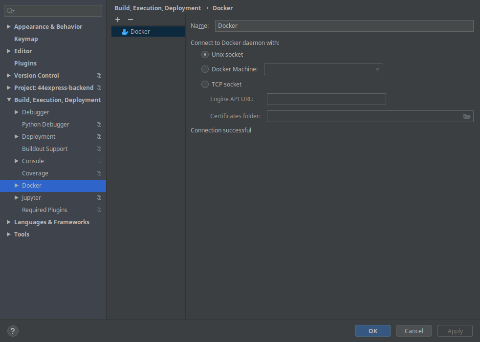

# Python Flask Template

This is a Rest Api template using python and flask framework.

This template contains:

* User authentication
* Integration with Amazon AWS S3 and kraken for image optimize and storage
* Migration scripts with Flask-Migrate
* Some basic features: cities, groups, states and users

>Step-by-step setup tutorial of the Python Flask Template.
>
>The tutorial assumes that the user's OS is UNIX based, **if not make the appropriate changes and select the correct OS in the documentation**. 
>
>_If running on Windows remember to enable Hyper-V and virtual environments._ 

#### Pre Requiments
* [Docker](https://docs.docker.com/engine/install/debian/)
> create docker group, _**you'll probably have to reboot after this**_.
```shell script
sudo groupadd docker
sudo usermod -aG docker $USER
```
* [Docker Compose](https://docs.docker.com/compose/install/)

#### Pycharm Integration
>It's possible to run your container and debug with it using PyCharm.

* Build, Execution, Deployment
>To enable docker in PyCharm go to: File>Settings>Build,Execution,Deployment>Docker
> 
>Click in the **+** icon and use the default settings

* Project Interpreter
>We need to create a remote python interpreter, basically the python interpreter running inside our container.
>
>Go to File>Settings>Project: python-flask-template>Python Interpreter
>
>Add a configuration clicking in the  icon and clicking on "Add" and configure it like so: 

* Run/Debug Configurations
>The final step in the setup is to configure the Run/Debug configuration, **create one using the Remote Interpreter**. 

#### Deploy
>First deploy
```shell script
docker-compose up --build
```
>Regular Deploy
```shell script
docker-compose up
 ```
>Once the project is up and running just debug the application by clicking in the debug icon 
>
>>You ready to go!

* Redeploy restoring all databases
```shell script
bash init.sh
```

#### Migrations and DB
>To make a migration on the database use:
```shell script
docker-compose exec api flask db migrate -m"<your message>"
```
>if there's a conflict with the migration heads, run:
```shell script
bash db-merge.sh
``` 